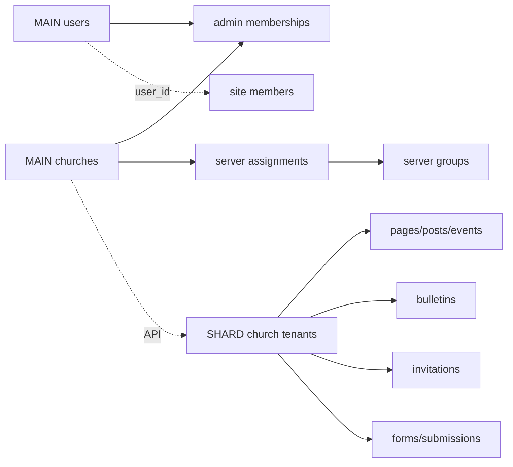

# Church Platform 데이터베이스 구조

## 1. 서버별 DB 분리

```text
MAIN DB
- 사용자 인증, 관리자 권한, 교회 계정
- 요금제·결제·도메인·서버 배정
- 트래픽 한도와 전체 운영

CHURCH SHARD DB
- 서버당 최대 20개 교회 콘텐츠
- 사이트 회원, 홈페이지, 주보, 복수 초대장
- 신청 폼, 파일, 디자인, 통계
```

MariaDB와 `utf8mb4`를 사용하고 시간은 UTC로 저장한다. 모든 교회 데이터에는 `church_id`를 둔다. MAIN과 SHARD DB는 직접 연결하지 않고 HTTPS API와 이벤트로 동기화한다. 파일은 디스크에 저장하고 DB에는 경로와 메타정보만 둔다.

## 2. MAIN DB 스키마

### 인증

```text
users
- id PK, email UNIQUE, password_hash, name
- phone_encrypted NULL
- status: pending/active/suspended/withdrawn
- email_verified_at, last_login_at
- created_at, updated_at, deleted_at

email_verification_tokens
- id, user_id, token_hash, expires_at, used_at

password_reset_tokens
- id, user_id, token_hash, expires_at, used_at

user_sessions
- id, user_id, refresh_token_hash
- ip_address, user_agent, expires_at, revoked_at

login_attempts
- id, email_hash, ip_address, result, attempted_at
```

인증 토큰 원문은 저장하지 않고 해시만 저장한다.

### 교회·권한·서버

```text
churches
- id PK, name, default_subdomain UNIQUE
- status, plan_code, server_group_id, opened_at
- created_at, updated_at

church_admin_memberships
- id, church_id, user_id
- role: owner/editor/viewer
- permissions_json, status, invited_by, accepted_at
- UNIQUE(church_id, user_id)

server_groups
- id, code UNIQUE, public_url, public_ip
- status: provisioning/testing/active/draining/failed
- capacity, active_churches
- storage_limit_bytes, traffic_limit_bytes
- application_version, database_schema_version
- infrastructure_version, last_health_check_at

church_server_assignments
- id, church_id UNIQUE, server_group_id
- status: pending/active/migrating/failed
- assigned_at, migration_started_at, migration_completed_at
```

### 도메인·상품·결제

```text
domains
- id, church_id, hostname UNIQUE
- type: default/custom
- status, is_primary, verification_token_hash
- ssl_status, verified_at, created_at, updated_at

plans
- code PK, name, monthly_price, yearly_price, status

plan_limits
- id, plan_code
- monthly_bandwidth_bytes, storage_limit_bytes
- monthly_page_view_limit, monthly_submission_limit
- active_invitation_limit, effective_from, effective_to

features
- id, code UNIQUE, name, category
- setup_price, monthly_price, module_version, status

plan_features
- plan_code, feature_id, enabled, usage_limit

church_features
- id, church_id, feature_id, status
- config_json, starts_at, ends_at
- setup_price, monthly_price

subscriptions
- id, church_id, plan_code, billing_cycle, status
- current_period_start, current_period_end, canceled_at

payments
- id, church_id, subscription_id
- provider, provider_payment_id UNIQUE
- amount, status, paid_at
```

### 트래픽·운영

```text
church_quota_overrides
- id, church_id, monthly_bandwidth_bytes, storage_limit_bytes
- starts_at, ends_at, reason, created_by

church_usage_monthly
- id, church_id, usage_month
- plan_code_snapshot, bandwidth_limit_bytes
- origin_bytes, cdn_bytes, media_bytes, total_bandwidth_bytes
- page_views, submissions, storage_bytes
- UNIQUE(church_id, usage_month)

church_usage_daily
- id, church_id, usage_date
- origin_bytes, cdn_bytes, media_bytes, total_bandwidth_bytes
- page_views, unique_visitors, submissions
- UNIQUE(church_id, usage_date)

traffic_import_batches
- id, source: nginx/cdn/storage
- server_group_id, period_start, period_end
- checksum, status, imported_at

notifications
- id, user_id, church_id, type, title, body, read_at

custom_feature_requests
- id, church_id, requested_by, title, description
- status: received/reviewing/quoted/approved/developing/testing/delivered
- estimate_amount, requested_due_at

audit_logs
- id, actor_user_id, church_id, server_group_id
- action, target_type, target_id
- ip_address, user_agent, metadata_json, created_at

outbox_events
- id, event_type, aggregate_type, aggregate_id
- payload_json, status, attempts, available_at, processed_at
```

## 3. CHURCH SHARD DB 스키마

### 교회 복제·사이트 회원

각 교회 도메인에 로그인·회원가입 화면을 제공하지만 비밀번호는 MAIN DB에서 관리한다.

```text
church_tenants
- church_id PK, name, status, plan_code, primary_domain
- feature_snapshot_json, synchronized_at

church_site_members
- id, church_id, user_id
- display_name, phone_encrypted
- status: pending/active/rejected/suspended/withdrawn
- approval_required, approved_by, approved_at
- joined_at, last_visited_at, deleted_at
- UNIQUE(church_id, user_id)

member_consents
- id, church_id, site_member_id
- consent_type, policy_version, agreed, agreed_at, withdrawn_at

member_notification_settings
- id, church_id, site_member_id
- email_enabled, event_enabled, bulletin_enabled
```

사이트 회원은 교적부가 아니며 심방·헌금·출석·가족관계·비밀상담 기록을 저장하지 않는다.

### 홈페이지·디자인

```text
church_profiles
- church_id PK, name, slogan, introduction
- logo_media_id, alternate_logo_media_id, hero_media_id
- address, latitude, longitude
- phone, email, parking_info, youtube_channel_url

church_design_settings
- church_id PK
- layout_code: header-left/header-center/header-overlay/header-stacked
- theme_code: warm/classic/next
- colors, font_preset, logo_size, header_height, sticky_header
- section_order_json, section_visibility_json, version

design_setting_versions
- id, church_id, settings_json, created_by, created_at

menus
- id, church_id, name, location: header/footer/mobile, status

menu_items
- id, church_id, menu_id, parent_id
- label, link_type: page/url/system
- page_id, url, system_route, sort_order, visible

pages
- id, church_id, title, slug
- page_type: standard/about/newcomer/location/custom
- status: draft/published/archived
- seo_title, seo_description, published_at
- created_by, updated_by, deleted_at
- UNIQUE(church_id, slug)

page_sections
- id, church_id, page_id
- section_type, title, subtitle
- content_json, style_json, sort_order, visible
```

### 예배·콘텐츠

```text
worship_services
- id, church_id, name, day_of_week, start_time
- location, description, sort_order, active

staff
- id, church_id, name, position, introduction
- photo_media_id, sort_order, active

post_categories
- id, church_id, name, slug, sort_order

posts
- id, church_id, category_id, type: notice/news
- title, slug, summary, body, featured_media_id
- status, published_at, created_by, updated_by, deleted_at

events
- id, church_id, title, slug, description
- starts_at, ends_at, location
- featured_media_id, registration_form_id, status, published_at

sermons
- id, church_id, title, preacher, preached_at
- bible_text, summary, youtube_url
- series_name, featured_media_id, status, published_at
```

### 온라인 주보

```text
bulletins
- id, church_id, title, service_date
- status: draft/published/archived
- pdf_media_id, qr_media_id, copied_from_id
- published_at, created_by, updated_by, deleted_at

bulletin_sections
- id, church_id, bulletin_id, section_type, title, sort_order

bulletin_items
- id, church_id, bulletin_section_id
- title, content, related_post_id, related_event_id, sort_order
```

### 복수 모바일 초대장

```text
event_types
- id, code, name, default_content_json, status, sort_order

invitation_layouts
- id, code: formal/warm-photo/festival/minimal
- name, version, status

invitations
- id, church_id, event_type_id, layout_id, event_id
- slug, title, message
- hero_media_id, share_media_id
- venue_name, address, latitude, longitude
- starts_at, ends_at, publish_at, unpublish_at
- status: draft/scheduled/published/ended/archived
- attendance_enabled, inquiry_enabled
- created_by, updated_by, deleted_at
- UNIQUE(church_id, slug)

invitation_sections
- id, church_id, invitation_id
- section_type, content_json, style_json, sort_order, visible

invitation_forms
- invitation_id, form_id
- purpose: attendance/inquiry/prayer/volunteer

invitation_stats_daily
- id, church_id, invitation_id, stat_date
- page_views, unique_visitors, share_clicks, qr_visits, submissions
```

### 신청·파일·통계

```text
forms
- id, church_id
- type: newcomer/attendance/event/volunteer/prayer/custom
- title, description, privacy_policy_version, retention_days
- status, created_by

form_fields
- id, church_id, form_id
- field_type, label, placeholder, required
- options_json, validation_json, sensitive, sort_order

submissions
- id, church_id, form_id
- invitation_id, site_member_id
- status: new/checked/contacted/completed
- submitted_at, expires_at, processed_by, processed_at

submission_values
- id, church_id, submission_id, field_id
- value_encrypted, value_search_hash

submission_status_logs
- id, church_id, submission_id
- previous_status, new_status, changed_by, note_encrypted

media_assets
- id, church_id, storage_disk, storage_path
- original_name, mime_type, size_bytes
- width, height, checksum
- category: logo/image/pdf/qr/document
- uploaded_by, created_at, deleted_at

page_views_daily
- id, church_id, stat_date, page_type, page_id
- page_views, unique_visitors, bandwidth_bytes
```

## 4. 핵심 관계와 인덱스



- 모든 SHARD 테이블: `(church_id, id)`
- 공개 주소: `UNIQUE(church_id, slug)`
- 게시 목록: `(church_id, status, published_at)`
- 초대장: `(church_id, status, publish_at, unpublish_at)`
- 신청: `(church_id, form_id, status, submitted_at)`
- 만료 개인정보: `(expires_at, status)`

MAIN DB와 SHARD DB 마이그레이션을 분리하고 `church-01`부터 순차 적용한다. 실행 전 자동 백업하고 완료 후 스키마 버전을 메인 서버에 보고한다.
